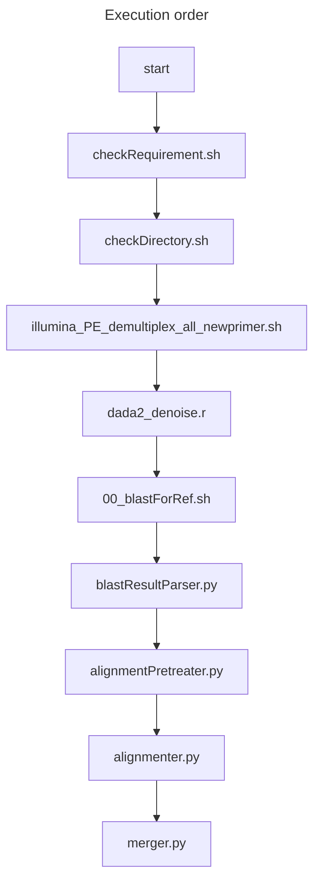
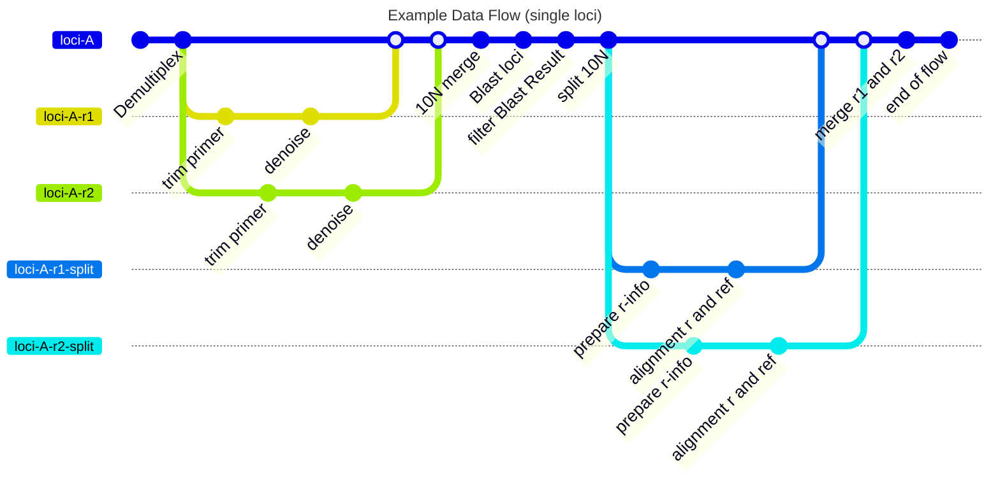

# Issue Undone

## 優先

0. 沒有result目錄，這次搬到server上是手動建的，應當要自動建出result及其第一層子目錄
1. fastp環境建置，給trim用，trim完的report要放到result，給user檢查一下定序品質 (V 已完成)
2. alignment方式調優 (V 已加速、已處理保留字誤入command)
3. 應先建立QC方法(base-on sanger's)，以加速驗證每次optimization的成果
   1. 按20230605結論處理目錄結構，清除不必要內容
   2. 按20230605結論處理QC方法(僅針對目錄檢查)
   3. 序列正確性比對(需與sanger's比對)
4. fine-tuning the parameters
5. 效能瓶頸排除：
   1. dada2
   2. cutadapt(V done by parallel computing)
   3. merge(V done by coroutine)

## Pending

1. 區分advance parameter跟normal parameter
2. 時區調整

### release v 1.0

1. QC
2. English comments
3. secondary merge module
4. dada2 的 chimera killing 功能 看能不加進去

### release v 2.0

1. 20230328 meeting
    1. R1 r2如何取，讓merge module更好用，可以接受更多元的input，更robust
    2. Grep??
    3. Regex??
2. 20200314 meeting
    1. ~~10n可以先拼起來~~
    2. Tandem repeat要注意一下(之前說的dada2)
    3. Trnlf 測試用run1 pool的即可，那筆最可靠
    4. pacbio可以不用

### release v 3.0

1. 接上雲端blast instance (https://blast.ncbi.nlm.nih.gov/Blast.cgi?CMD=Web&PAGE_TYPE=BlastDocs&DOC_TYPE=CloudBlast)
   自動化blast

## Done

### [features-fineTuningParametersWithTrnLF_20230420] 20230328

1. TODO

### [features-dada10N_20230111] 20230420

1. DADA2的10N
2. With the work of GUI with docker, the following requirements are deprecated:
    1. ~~powerbarcode.sh的執行方式是powerbarcoder -config XXX/路徑/XXX/pbc.config~~
    2. ~~可能有人 不清楚 要先cd 去那裏執行 powerbarcoder.sh，最好全都改寫成傳參寫法的絕對路徑~~
    3. ~~看要不要寫一個 powerbarcoder.py 來將 config 的設定讀進去，讓他們(設定檔、執行檔)兩個人的功能是分開清楚的~~
3. GUI html page virtual scrolling or socket emit optimization (we choose throttle the socket emit)

### [features-multiLoci_20230103] 20230215

1. secondary merge ： rbcLC + rbcLN (deadline 20230215)

### [features-dada10N_20230111] 20230111

1. 參數替換成變數 (20230111)
2. add checkDirectory.sh (20230111)
3. "log_dada2.txt" 應該要跟其他result files 放一起比較合理 (20230111)
4. create new result files (de-gaps and de-Ns merge files for making tree) (20230113)
5. blast相關中繼檔 放到 ${resultDataPath}/blastResult內 (20230113)

### [features-multiLoci_20230103] 20230104

1. 可一次執行多位點的barcode，從config.sh檔可以增減位點(感謝亦烜處理前半段)
2. 將讀檔區與產生檔案的路徑設為變數，使用者可以在powerbarcoder主檔路徑外內產出結果

# 運行邏輯

取出denoise best的nonmerge資料夾內的r1跟r2
從r1及r2資料夾中取出來blast(所以第一步的路徑要抽換成今天的)
//home/lykuo/lab_data/NGS_data/miseq/test_LIB720/rbcLN_result/denoise_best/nonmerged/r1

執行順序

1. '00_blastForRef.sh'：執行localBlast，獲得參考序列的檔案refResult.txt
2. 'blastResultParser.py'：將localBlast結果轉換成物件(BlastRef)，並在blastResult資料夾內寫出成檔案blastResult.txt
   #重啟後大部分檔案都會被覆寫，唯獨blastResult.txt看不會，需要刪除其他localblast的檔案才會有新的生成

從這裡開始需要執行for迴圈，希望可以只讀一次blastResult

1. 'nnSpliter.py'：DADA2生成的r1-10N-r2要做切分，切成/nonmerged/r1資料夾跟/nonmerged/r2資料夾
2. 'alignmentPretreater.py'：align前我們需要在此利用r1 r2製作他們的r1Ref及r2Ref的序列
3. 'alignmenter.py'：將r1 r2序列align
4. 'merger.py'：開始合併align好的r1 r2從物件(Miseq、FastaUnit)寫出成檔案

調用的類別(當資料有多個key:value時，用物件存比較方便操作)

1. 'BlastRef.py' (localblast結果的物件)
2. 'FastaUnit.py' (fasta檔的物件)
3. 'Miseq.py' (要拼接的r1或r2的物件)

